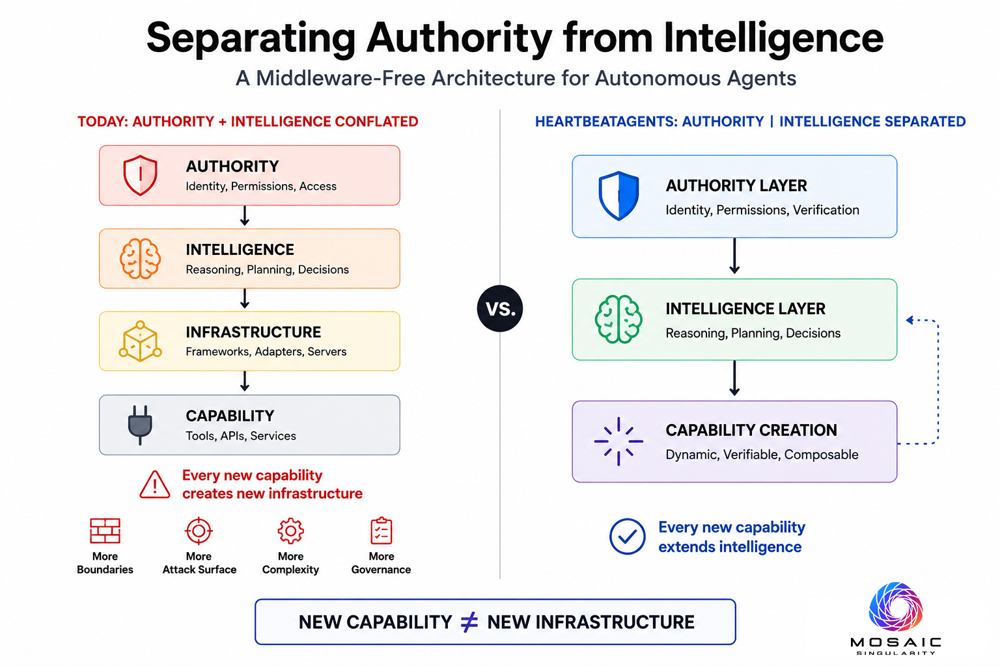

# HeartBeatAgents

## The Operating System for Owned Intelligence

HeartBeatAgents is the operating system for owned intelligence.

Agents create capabilities.
Capabilities repair automations.
Intelligence compounds for the operator.

Your infrastructure.
Your models.
Your intelligence.

---

## The Architectural Thesis

Most agent platforms place middleware between intelligence and capability.

Every new capability introduces:

- additional boundaries
- additional attack surfaces
- additional deployment complexity
- additional governance overhead

HeartBeatAgents removes the middleware tier entirely.

Authority is provided by infrastructure.  
Intelligence is provided by the agent.  
The platform serves as judge.

Every new capability extends intelligence rather than infrastructure.

---

## Research

**Separating Authority from Intelligence: A Middleware-Free Architecture for Autonomous Agents**

DOI: [10.5281/zenodo.20836108](https://doi.org/10.5281/zenodo.20836108)

[Read Paper](https://doi.org/10.5281/zenodo.20836108)

[View Graphic Abstract](https://doi.org/10.5281/zenodo.20836108)

[Watch Live Demo](https://youtu.be/P76CT_jaSMM)

---

## Downloads

Download the latest release:

[Latest Release](https://github.com/MosaicSingularity/heartbeatagents-releases/releases/latest)

Supported platforms:

- macOS (Apple Silicon)
- macOS (Intel)
- Windows
- Linux (.deb)
- Linux (.rpm)
- Linux (AppImage)

---

## Security

Every release includes:

- SHA256 checksums
- GPG signatures
- Apple notarization
- EV code signing
- Verification instructions
- Audit records

Trust is engineered, not assumed.

---

## Documentation

[Installation Guide](https://www.heartbeatagents.com/docs/getting-started)

[Architecture Overview](https://www.heartbeatagents.com/blueprint)

---

## Repository Scope

This repository provides public executable releases, installation assets, verification materials, and research artifacts for HeartBeatAgents.

Source code is proprietary and is not distributed in this repository.

---

## Mosaic Singularity

Mosaic Singularity is architecting the infrastructure that makes intelligence universally ownable.

[Mosaic Singularity](https://www.mosaicsingularity.com)

[HeartBeatAgents](https://www.heartbeatagents.com)
